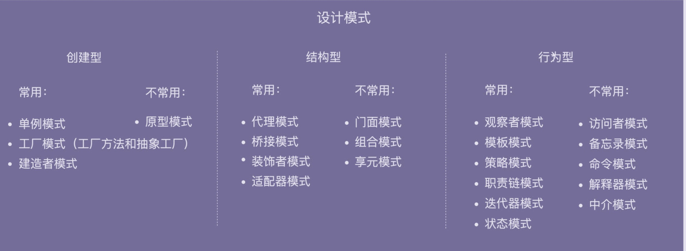
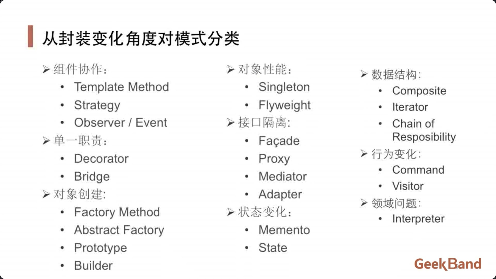
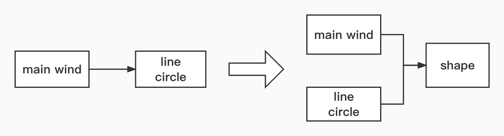
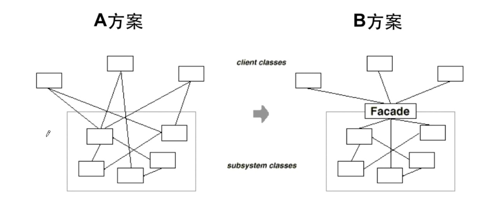

# 设计模式





## 面向对象设计原则


**依赖倒置原则（DIP）**

* 高层模块（稳定）不应该依赖与底层模块（变化），二者都应该依赖于抽象（稳定）。
* 抽象（稳定）不应该依赖于实现细节（变化），实现细节应该依赖于抽象（稳定）。



**开放封闭原则（OCP）**

* 对扩展开放，对更改封闭。
* 类模块应该是可扩展的，但是不可修改。

**单一职责原则（SRP）**

* 一个类应该仅有一个引起它变化的原因。
* 变化的方向隐含着类的责任。

**Liskov替换原则（LSP）**

* 子类必须能够替换他们的基类（IS-A）。
* 继承表达类型抽象。

**接口隔离原则（ISP）**

* 不应该强迫客户程序依赖他们不用的方法。
* 接口应该小而完备。

**优先使用对象组合，而不是类继承**

* 类继承通常为“白箱复用”，对象组合通常为“黑箱服用”。
* 继承在某种程度上破坏了封装性，子类父耦合度高。
* 而对象组合则只要求被组合的对象具有良好定义的接口，耦合度低。

**封装变化点**

* 使用封装来创建对象之间的分界层，让设计者可以在分界层的一侧进行修改，而不会对另一侧产生不良的影响，从而实现层次间的松耦合。

**针对接口编程，而不是针对实现编程**

* 不将变量类型声明为某个特定的具体类，而是声明为某个接口。
* 客户程序无需获知对象的具体类型，只需要知道对象所具有的接口。
* 减少系统中各部分的依赖关系，从而实现“高内聚，松耦合”的类型设计方案。


## 重构关键技法

* 静态 -> 动态。
* 早绑定 -> 晚绑定。
* 继承 -> 组合。
* 编译时依赖 -> 运行时依赖。
* 紧耦合 -> 松耦合。


## 一、模版方法（Template）

背景：在软件构建过程中，对于某一项任务，常常有稳定的整体操作结构，但各个子步骤却有很多改变的需求，或者由于固有的原因（框架与应用之间的关系）而无法和任务的整体结构同时实现。

实现：定义一个操作中的算法骨架（稳定），而将一些步骤延迟到子类中。使得子类可以不改变（复用）一个算法的结构即可重定义该算法的某些特定步骤。

```shell
code/template
├── improve
│   ├── app.go
│   └── lib
│       └── lib.go
└── initial
    ├── app.go
    └── lib
        └── lib.go
```


## 二、策略模式（Strategy）

背景：在软件构建过程中，某些对象使用的算法可能多种多样，经常改变，如果将这些算法都编码到对象中，将会使对象变得异常复杂，而且有时候支持不使用的算法也是一个性能负担。

实现：定义一系列算法，把它们一个一个封装起来，并且使它们可互相替换（变化）。该模式使得算法可独立于使用它的客户程序（稳定）而变化（扩展、子类化）。

```shell
code/strategy
├── improve
│   └── tax.go
└── initial
    └── tax.go
```


## 三、观察者模式（Observer）

背景：在软件构建过程中，我们需要为某些对象建立一种“通知依赖关系”——一个对象（目标对象）的状态发生改变，所有的依赖对象（观察者对象）都将得到通知。如果这样的依赖关系过于紧密，将使软件不能很好地抵御变化。

实现：定义对象间的一种多对多（变化）的依赖关系，以便当一个对象的状态发生改变时，所有依赖于它的对象都得到通知并自动更新。

```shell
code/observer
├── imporve
│   ├── clock.go
│   └── clocktimer
│       └── clocktimer.go
└── initial
    └── clock.go
```


## 四、装饰模式（Decorator）

背景：某些情况下可能会“过度地使用继承来扩展对象的功能”，由于继承为类型引入的静态特质，使得这种扩展方式缺乏灵活性：并且随着子类的增多（扩展功能的增多），各种子类的组合（扩展功能的组合）会导致更多子类的膨胀。

实现：动态（组合）地给一个对象增加一些额外的职责。九增加功能而言，Decorator模式比生产子类（继承）更为灵活（消除重复代码、减少子类个数）。

```shell
code/decorator
├── improve
│   ├── main.go
│   └── stream
│       └── stream.go
└── initial
    ├── main.go
    └── stream
        ├── filestream
        │   └── filestream.go
        ├── memorystream
        │   └── memorystream.go
        ├── networkstream
        │   └── networkstream.go
        └── stream.go
```


## 五、桥模式（Bridge）

背景：由于某些类型的固有的实现逻辑，使得它们具有两个变化的维度，乃至多个维度的变化。

实现：将抽象部分（业务功能）于实现部分（平台实现）分离，使它们都可以独立地变化。

```shell
code/bridge
├── improve
│   ├── main.go
│   └── messager
│       ├── messager.go
│       ├── mobilemessager
│       │   └── mobilemessager.go
│       └── pcmessager
│           └── pcmessager.go
└── initial
    ├── main.go
    └── messager
        ├── messager.go
        ├── mobilemessager
        │   └── mobilemessager.go
        └── pcmessager
            └── pcmessager.go
```


## 六、工厂方法（Factory Method）

背景：在软件系统中，经常面临着创建对象的工作；由于需求的变化，需要创建的对象的具体类型经常变化。

实现：定义一个用于创建对象的接口，让子类决定实力化哪个类，使得一个类的实例化延迟。

```shell
code/factorymethod
├── improve
│   ├── main.go
│   └── splitter
│       ├── base.go
│       └── specific.go
└── initial
    ├── main.go
    └── splitter
        └── splitter.go
```


## 七、抽象工厂（Abstract Factory）

背景：在软件系统中，经常面临着“一系列相互依赖的对象”的创建工作；同时，由于需求的变化，往往存在更多系列对象的创建工作。

实现：提供一个接口，让该接口负责创建一系列“相关或者相互依赖的对象”，无需指定它们具体的类。

```shell
code/abstractfactory
├── improve
│   ├── database
│   │   ├── database.go
│   │   ├── oracle
│   │   │   └── oracle.go
│   │   └── sql
│   │       └── sql.go
│   └── main.go
└── initial
    ├── database
    │   ├── databases.go
    │   ├── oracle
    │   │   └── oracle.go
    │   └── sql
    │       └── sql.go
    └── main.go
```


## *八、原型模式（Prototype）

背景：在软件系统中，经常面临着“某些结构复杂的对象“的创建工作；由于需求的变化，这些对象经常面临着剧烈的变化，但是它们却拥有比较稳定一致的接口。

实现：使用原型实例指定创建对象的种类，然后通过拷贝这些原型来创建新的对象。


## *九、构建器（Builder）

背景：在软件系统中，有时候面临着“一个复杂对象”的创建工作，其通常由各个部分的子对象用一定的算法构成；由于需求的变化，这个复杂对象的各个部分经常面临着剧烈的变化，但是将它们组合在一起的算法却相对稳定。

实现：将一个复杂对象的构建与其表示相分离，使得同样的构建过程（稳定）可以创建不同的表示（变化）。


## 十、单件模式（Singleton）

背景：在软件系统之，经常有这样一些特殊的类，必须保证它们在系统中只存在一个实例，才能保证它们的逻辑正确性和良好的效率。

实现：保证一个类只有一个实例，并提供一个该实例的全局访问点。

```shell
code/singleton
├── improve
│   └── main.go
└── initial
    └── main.go
```


## *十一、享元模式（Flyweight）

背景：在软件系统采用纯粹对象方案的问题在于大量细粒度的对象会很快充斥在系统中，从而带来很高的运行时代价——主要指内存需求方面的代价。

实现：使用共享技术有效地支持大量粒度的对象。


## *十二、门面模式（Facade）

背景：组件的客户和组件中各种复杂的子系统有过多的耦合，随着外部客户程序和各子系统的演化，这种过多的耦合面临着很多变化的挑战。

实现：为子系统中的一组接口提供一个一致（稳定）的界面，Facade模式定义了一个高层接口，这个接口使得这一子系统更加容易使用（复用）。


## *十三、代理模式（Proxy）

背景：在面向对象系统中，有些对象由于某种原因（比如对象创建的开销很大，或者某些操作需要安全控制，或者需要进程外的访问等），直接访问会给使用者、或者系统结构带来很多麻烦。

实现：为其他对象提供一种代理以控制（隔离，使用接口）对这个对象的访问。


## 十四、适配器（Adapter）

背景：在软件系统中，由于应用环境的变化，常常需要将“一些现存的对象”放在新的环境中应用，但是新环境要求的接口是这些现存对象所不满足的。 

实现：将一个类的接口转换为客户希望的另一个接口。Adapter模式使得原本由于接口不兼容而不能一起工作的那些类可以一起工作。

```shell
code/adapter
└── adapter.go
```


## *十五、中介者（Mediator）

背景：在软件构建过程中，经常会出现多个对象互相关联交互的情况，对象之间常常会维持一种复杂的引用关系，如果遇到一些需求的更改，这种直接的引用关系将面临不断的变化。

实现：用一个中介对象来封装一系列的对象交互。中介者使各对象不需要显式的相互饮用（编译时依赖 -> 运行时依赖），从而使其耦合松散，而且可以独立地改变它们之间的交互。  

 

## 十六、状态模式（State）

背景：在软件构建过程中，某些对象的状态如果改变，其行为也会随之而发生变化，比如文档处于只读状态，其支持的行为和读写状态支持的行为就可能完全不同。 

解决：允许一个对象在其内部状态改变时改变他的行为，从而使对象看起来似乎修改了其行为。

```shell
code/state
├── improve
│   ├── networkstate
│   │   └── networkstate.go
│   └── state.go
└── initial
    └── state.go
```


## 十七、备忘录（Memento）

 背景：在软件构建过程中，某些对象的状态在转换过程中，可能由于某种需要，要求程序能够回溯到对象之前处于某个点时的状态。如果使用一些共有接口来让其他对象得到对象的状态，便会暴露对象的细节实现。

实现：在不破坏封装性的前提下，捕获一个对象的内部状态，并在该对象之外保存这个状态。这样以后就可以将改对象恢复到原先保存的状态。


## 十八、组合模式（Composite）

背景：软件在某些情况下，客户代码过多地依赖于对象容器复杂的内部实现结构，对象容器内部实现结构（而非抽象接口）的变化将引起客户代码的频繁变化，带来了代码的维护性、拓展性等弊端。

实现：将对象组合成树形结构以表示“部分-整体”的层次结构，使得用户对单个对象和组合对象的使用具有一致性。

```shell
code/composite
└── composite.go
```


## 十九、迭代器（Iterator）

背景：在软件构建过程中，集合对象内部结构常常变化各异，但对于这些集合对象，我们希望在不暴露其内部结构的同时，可以让外部客户代码透明地访问其中包含的元素；同时这种“透明遍历”也为“同一种算法在多种集合对象上进行操作”提供了可能。

实现：提供一种方法顺序访问一个聚合对象中的各个元素，而又不暴露（稳定）改对象的内部表示。


## 二十、职责链（Chain of Responsibility）

背景：在软件构建过程中，一个请求可能被多个对象处理，但是每个请求在运行时只能有一个接受者，如果显式指定，将必不可少地带来请求发送者与接受者的紧耦合。

实现：使多个对象都有机会处理请求，从而避免请求的发送者和接收者之间的耦合关系。将这些对象连成一条链，并沿着这条链传递请求，直到有一个对象处理它为止。

```shell
code/responsibility
└── responsibility.go
```


## 二一、命令模式（Command）

背景：在软件构建过程中，“行为请求者”与“行为实现者”通常呈现一种“紧耦合”。但在某些场合——比如需要对行为进行“记录、撤销/重做、事务”等处理，这种无法抵御变化的紧耦合是不适合的。

实现：将一个请求（行为）封装为一个对象，从而使你可用不同的请求对客户进行参数化：对请求排队或记录请求日志，以及支持可撤销的操作。

```shell
code/command
└── command.go
```


## 二二、访问器（Visitor）

背景：在软件构建过程中，由于需求的改变，某些类层次结构中常常需要增加新的行为（方法），如果直接在基类中做这样的更改，将会给子类带来很繁重的变更负担，甚至破坏原有设计。

实现：表示一个作用与某对象结构中的各元素的操作。使得可以在不改变（稳定）各元素的类的前提下定义（扩展）作用于这些元素的新操作（变化）

```shell
code/visitor
└── visitor.go
```


## *二三、解析器（Interpreter）

背景：在软件构建过程中，如果某一特定领域的问题比较复杂，类似结构不断重复出现，如果使用普通的编程方式来实现将面临非常频繁的变化。

实现：给定一个语言，定义它的文法的一种表示，并定义一种解释器，这个解释器使用该表示来解释语言中的句子。

  

